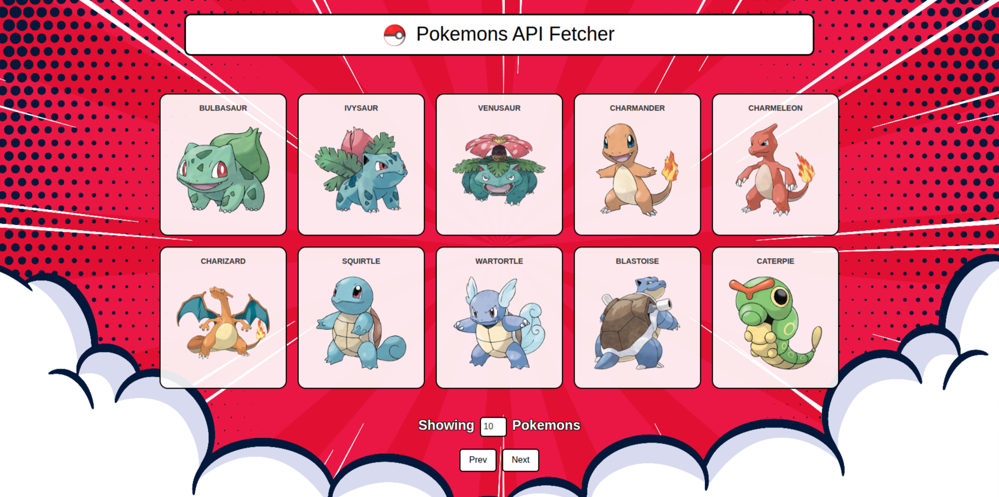
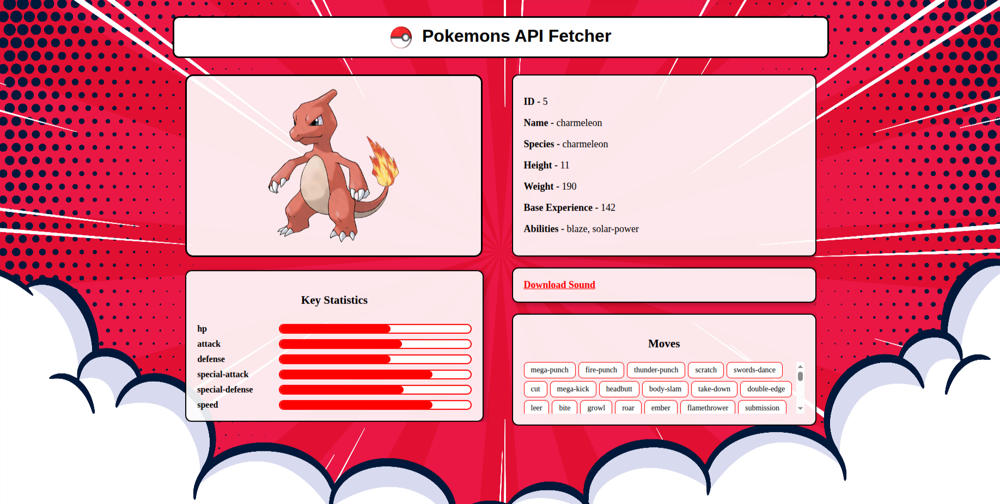

# ⚡ Fetch PokeAPI - Pokémon Explorer

A simple web app that lists all Pokémon using the [PokeAPI](https://pokeapi.co/) and allows users to click on a Pokémon to view detailed stats, moves, abilities, and more — including official artwork and a downloadable cry/sound!

---

## 📸 Preview

> ✅ Pokémon List Page  
> ✅ Clickable Cards with Images  

> ✅ Details Page: Stats, Moves, Abilities, Sound, and More


---

## 🛠️ Technologies Used

- HTML5
- CSS3
- JavaScript (ES6+)
- [PokeAPI](https://pokeapi.co/) - Free Pokémon REST API

---

## 🚀 Features

### 🗂️ Main Page - Pokémon List

- Fetches **all Pokémon** names and IDs.
- Displays each Pokémon in a card with its **name** and **official artwork**.
- Cards are clickable and redirect to a **details page**.
- Pagination support with **Next** and **Previous** buttons.
- User can set how many Pokémon to show per page (`input#num`).

### 📄 Details Page - Pokémon Info

- Fetches Pokémon details by `id` from URL query parameters.
- Displays:
  - Official image
  - Name, ID, species, height, weight, base experience
  - All abilities
  - All available **moves**
  - Key statistics as a **bar graph**
  - A link to download the **Pokémon cry/sound**

---

## 🔍 How It Works

### 🔗 From List to Details

Each Pokémon has a unique ID fetched from the URL:

```javascript
const query = window.location.search;
const params = new URLSearchParams(query);
const id = params.get('id');
```

This `id` is used to fetch details from:

```
https://pokeapi.co/api/v2/pokemon/{id}/
```

---

### 🎨 Displaying Details

The detail page includes:

* 🖼️ **Image** from official artwork
* 📊 **Stats Bar Chart**:

```html
<div class="stat-bar">
  <div class="stat-fill" style="width: {value}%"></div>
</div>
```

* 🔈 **Sound**:

```html
<a href="${data.cries.latest}" target="_blank">Download Sound</a>
```

* 📋 **Moves**:

```javascript
data.moves.forEach(m => {
  let span = document.createElement("span");
  span.textContent = m.move.name;
  movesList.appendChild(span);
});
```

---

## ✅ Setup Instructions

1. **Clone the repository** or download files.
2. Open `Pokemon.html` in any browser.
3. Select the number of Pokémon to view.
4. Click a Pokémon to view detailed stats on `PokemonDetails.html`.

> **No server or build tools needed** — it runs entirely in the browser.

---

## 🌟 Improvements You Can Make

* Add a **loading spinner** while data is fetched.
* Add a **search bar** to find Pokémon by name or ID.
* Add **filters** by type, generation, or abilities.
* Add **responsive layout** for mobile.
* Use a **charting library** (e.g., Chart.js or ECharts) for nicer stats.

---

## 🙌 Acknowledgements

* Thanks to [PokeAPI](https://pokeapi.co/) for the free and awesome Pokémon data & media.
* Pokémon © Nintendo, Game Freak, and The Pokémon Company.

---

## 📜 License

This project is open-source under the MIT License.

---

## 🧠 Author Notes

Made as a fun exploration of using `fetch`, `async/await`, and DOM manipulation using public APIs. Great for learning modern JavaScript!

